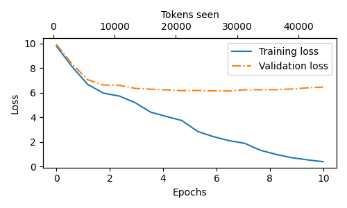

# LLMs_from_scratch
Learning records for building a large language model from scratch

### Records

 - **Section 1**:

- [x] Understanding word embeddings

- [x] Tokenizing text

- [x] Converting tokens into token IDs

- [x] Adding special context tokens

- [x] Byte pair encoding (TODO: more details)

- [x] Data sampling with a sliding window

- [x] Creating token embeddings

- [x] Encoding word positions

 - **Section 2**:

- [x] Capturing data dependencies with attention mechanisms

- [x] Implementing self-attention with trainable weights

- [x] Hiding feature words with causal attention

- [x] Multi-head attention

 - **Section 3**:

- [x] Activations and layer normalization

- [x] Adding shortcut connections

- [x] Build a Transformer block

- [x] Coding the GPT model

- [x] Generating text

 - **Section 4**:

- [x] Evaluating generative text model

- [x] Training an LLM

- [x] Greedy search and Top-k sampling

- [ ] Load pretrained weights from OpenAI

 - **Section 5**:

- [x] Prepare spam email dataset and dataloader

- [ ] Fine-tune the model on supervised data

